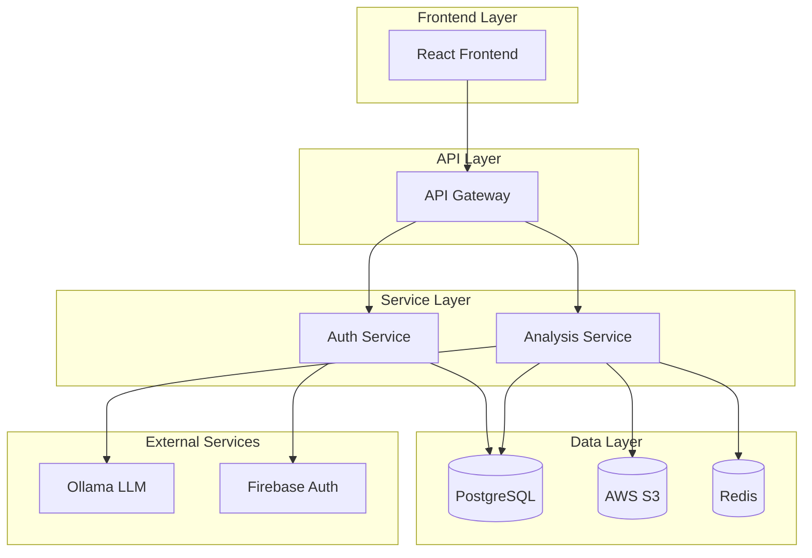

# CVVIN Platform Implementation Plan

## Executive Summary

This document outlines the comprehensive implementation plan for transitioning the CVVIN platform from its current Node.js-only architecture to a hybrid microservices architecture incorporating Python-based LLM analysis capabilities. The plan preserves existing functionality while adding advanced resume analysis features.

## Current State Analysis

### Existing Components
- **Frontend**: React/TypeScript application with comprehensive UI
- **Backend**: Node.js/Express authentication service
- **Authentication**: Firebase integration with OTP management
- **Trial Implementation**: Python-based Ollama resume analysis

### Strengths to Preserve
- Complete frontend functionality
- Robust authentication system
- User management and session handling
- Email service integration
- Existing API endpoints

### Areas for Enhancement
- Resume analysis capabilities
- File processing and storage
- LLM integration
- Scalability and performance
- Background processing

## Implementation Phases

### Phase 1: Foundation Setup (Weeks 1-2)

#### Week 1: Project Restructuring
**Objectives:**
- Set up new project structure
- Create API Gateway service
- Establish development environment
- Set up Docker containers

**Tasks:**
1. **Project Structure Setup**
   - Create new directory structure
   - Move existing code to appropriate locations
   - Set up workspace configuration
   - Create shared utilities and types

2. **API Gateway Implementation**
   - Create Express.js gateway service
   - Implement request routing
   - Add authentication middleware
   - Set up CORS and security headers

3. **Development Environment**
   - Create Docker Compose configuration
   - Set up local PostgreSQL database
   - Configure Redis for caching
   - Set up Ollama service

**Deliverables:**
- New project structure
- Working API Gateway
- Docker development environment
- Updated documentation

#### Week 2: Analysis Service Foundation
**Objectives:**
- Create Python analysis service
- Implement basic FastAPI structure
- Set up database models
- Create file processing utilities

**Tasks:**
1. **FastAPI Service Setup**
   - Create FastAPI application structure
   - Implement configuration management
   - Set up database connection
   - Add logging and error handling

2. **Database Integration**
   - Create SQLAlchemy models
   - Implement database migrations
   - Set up connection pooling
   - Add health check endpoints

3. **File Processing Foundation**
   - Implement PDF text extraction
   - Create file validation utilities
   - Set up S3 integration
   - Add file metadata handling

**Deliverables:**
- Working FastAPI service
- Database models and migrations
- File processing utilities
- Basic API endpoints

### Phase 2: Core Analysis Features (Weeks 3-4)

#### Week 3: Ollama Integration
**Objectives:**
- Integrate enhanced Ollama service
- Implement resume analysis workflow
- Add result validation and storage
- Create analysis API endpoints

**Tasks:**
1. **Enhanced Ollama Service**
   - Implement retry logic and error handling
   - Add input validation and sanitization
   - Create response parsing and validation
   - Add performance monitoring

2. **Analysis Workflow**
   - Create complete analysis pipeline
   - Implement background processing
   - Add progress tracking
   - Set up result caching

3. **API Endpoints**
   - Resume analysis endpoint
   - Analysis history endpoint
   - File upload endpoint
   - Health check endpoints

**Deliverables:**
- Working Ollama integration
- Complete analysis workflow
- RESTful API endpoints
- Error handling and validation

#### Week 4: File Management System
**Objectives:**
- Implement comprehensive file handling
- Add S3 integration with CDN
- Create file processing pipeline
- Implement file security and access control

**Tasks:**
1. **File Storage System**
   - S3 bucket configuration
   - CloudFront CDN setup
   - File upload and download
   - Presigned URL generation

2. **File Processing Pipeline**
   - PDF text extraction
   - File validation and security
   - Metadata extraction
   - File deduplication

3. **Security Implementation**
   - File access control
   - Virus scanning integration
   - Content type validation
   - Size and format restrictions

**Deliverables:**
- Complete file management system
- S3 and CloudFront integration
- File processing pipeline
- Security measures

### Phase 3: Integration and Testing (Weeks 5-6)

#### Week 5: Frontend Integration
**Objectives:**
- Connect frontend to new services
- Update API calls and data flow
- Implement new UI components
- Add error handling and loading states

**Tasks:**
1. **API Integration**
   - Update API service calls
   - Implement new endpoints
   - Add authentication headers
   - Handle new response formats

2. **UI Components**
   - Resume upload component
   - Analysis results display
   - Progress indicators
   - Error handling UI

3. **State Management**
   - Update Redux/Context state
   - Add new data types
   - Implement caching
   - Add optimistic updates

**Deliverables:**
- Updated frontend integration
- New UI components
- Improved user experience
- Error handling

#### Week 6: Testing and Quality Assurance
**Objectives:**
- Comprehensive testing suite
- Performance optimization
- Security testing
- User acceptance testing

**Tasks:**
1. **Testing Implementation**
   - Unit tests for all services
   - Integration tests
   - End-to-end tests
   - Load testing

2. **Performance Optimization**
   - Database query optimization
   - Caching implementation
   - API response optimization
   - Frontend performance tuning

3. **Security Testing**
   - Penetration testing
   - Vulnerability scanning
   - Authentication testing
   - Data protection validation

**Deliverables:**
- Complete test suite
- Performance benchmarks
- Security audit report
- Quality assurance documentation

### Phase 4: Production Deployment (Weeks 7-8)

#### Week 7: Staging Deployment
**Objectives:**
- Deploy to staging environment
- Configure production-like setup
- Perform comprehensive testing
- Optimize performance

**Tasks:**
1. **Staging Environment**
   - Set up cloud infrastructure
   - Configure production databases
   - Set up monitoring and logging
   - Implement CI/CD pipeline

2. **Testing and Validation**
   - End-to-end testing
   - Performance testing
   - Security validation
   - User acceptance testing

3. **Optimization**
   - Performance tuning
   - Resource optimization
   - Cost optimization
   - Monitoring setup

**Deliverables:**
- Staging environment
- Performance metrics
- Security validation
- Deployment documentation

#### Week 8: Production Launch
**Objectives:**
- Deploy to production
- Monitor system performance
- Handle user feedback
- Plan future enhancements

**Tasks:**
1. **Production Deployment**
   - Deploy all services
   - Configure production databases
   - Set up monitoring and alerts
   - Implement backup strategies

2. **Launch Activities**
   - User communication
   - Support documentation
   - Monitoring and alerting
   - Issue tracking and resolution

3. **Post-Launch**
   - Performance monitoring
   - User feedback collection
   - Bug fixes and improvements
   - Future roadmap planning

**Deliverables:**
- Production deployment
- Monitoring dashboard
- User documentation
- Future enhancement plan

## Technical Implementation Details

### 1. Service Architecture



### 2. Database Schema Evolution

#### Migration Strategy
1. **Phase 1**: Create new tables alongside existing ones
2. **Phase 2**: Migrate data from existing system
3. **Phase 3**: Update application code to use new schema
4. **Phase 4**: Remove old tables after validation

#### Key Tables
- `users`: User profile information
- `user_profiles`: Extended user data
- `resume_analyses`: Analysis results
- `interview_sessions`: Session management
- `files`: File metadata and storage info

### 3. API Design

#### Authentication Flow
```
1. User logs in via Firebase
2. Frontend receives JWT token
3. API Gateway validates token
4. Requests routed to appropriate service
5. Service validates user permissions
```

#### Analysis Flow
```
1. User uploads resume PDF
2. File stored in S3
3. Text extracted from PDF
4. Analysis request sent to Ollama
5. Results stored in database
6. Response sent to frontend
```

### 4. Security Implementation

#### Authentication
- Firebase JWT validation
- Role-based access control
- API key management
- Rate limiting

#### Data Protection
- Encryption at rest and in transit
- PII data handling
- GDPR compliance
- Audit logging

#### File Security
- Virus scanning
- Content validation
- Access control
- Secure file URLs

## Risk Management

### 1. Technical Risks

#### High Risk
- **Ollama Performance**: LLM response times and accuracy
- **File Processing**: Large file handling and processing
- **Database Performance**: Query optimization and scaling

#### Medium Risk
- **Service Integration**: Communication between services
- **Data Migration**: Existing data preservation
- **Frontend Compatibility**: UI/UX consistency

#### Low Risk
- **Infrastructure**: Cloud service availability
- **Third-party Dependencies**: External service reliability

### 2. Mitigation Strategies

#### Performance Issues
- Implement caching layers
- Add load balancing
- Optimize database queries
- Use CDN for file delivery

#### Integration Problems
- Comprehensive testing
- Gradual rollout
- Fallback mechanisms
- Monitoring and alerting

#### Data Loss Prevention
- Regular backups
- Data validation
- Migration testing
- Rollback procedures

## Success Metrics

### 1. Technical Metrics
- **Response Time**: < 2 seconds for analysis requests
- **Uptime**: 99.9% availability
- **Error Rate**: < 1% failure rate
- **Throughput**: Handle 100 concurrent users

### 2. Business Metrics
- **User Adoption**: 80% of users try new features
- **Analysis Accuracy**: 90% user satisfaction
- **Performance**: 50% improvement in analysis speed
- **Cost**: Maintain current operational costs

### 3. Quality Metrics
- **Test Coverage**: > 90% code coverage
- **Security**: Zero critical vulnerabilities
- **Documentation**: Complete API documentation
- **Maintainability**: Code quality scores > 8/10

## Resource Requirements

### 1. Human Resources
- **Backend Developer**: Python/FastAPI expertise
- **DevOps Engineer**: Infrastructure and deployment
- **QA Engineer**: Testing and validation
- **Project Manager**: Coordination and oversight

### 2. Infrastructure Resources
- **Development**: Local Docker environment
- **Staging**: Cloud infrastructure (AWS/GCP)
- **Production**: High-availability setup
- **Monitoring**: Observability tools

### 3. Budget Considerations
- **Development**: $50,000 (8 weeks)
- **Infrastructure**: $500/month (staging), $2,000/month (production)
- **Third-party Services**: $200/month (Ollama, S3, etc.)
- **Total First Year**: ~$75,000

## Timeline Summary

| Phase | Duration | Key Deliverables | Success Criteria |
|-------|----------|------------------|------------------|
| Phase 1 | 2 weeks | Project structure, API Gateway, Development environment | All services running locally |
| Phase 2 | 2 weeks | Analysis service, Ollama integration, File management | Complete analysis workflow |
| Phase 3 | 2 weeks | Frontend integration, Testing, Quality assurance | All features working end-to-end |
| Phase 4 | 2 weeks | Staging deployment, Production launch | Live system with monitoring |

## Conclusion

This implementation plan provides a comprehensive roadmap for transitioning the CVVIN platform to a modern, scalable architecture while preserving existing functionality and adding advanced LLM-powered features. The phased approach minimizes risk while ensuring quality and performance standards are met.

The plan emphasizes:
- **Preservation of existing functionality**
- **Gradual migration and testing**
- **Scalable architecture design**
- **Comprehensive quality assurance**
- **Production-ready deployment**

Success depends on careful execution of each phase, continuous testing and validation, and maintaining clear communication with stakeholders throughout the implementation process.

