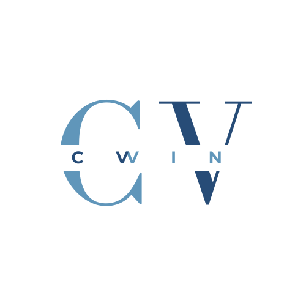

# CVVIN Platform Assets

This directory contains all static assets used throughout the CVVIN platform that are **not directly bundled** with the frontend application.

## 📁 Directory Structure

```
assets/
├── logos/          # Brand logos and variations
├── images/         # General images, screenshots, diagrams
├── icons/          # Custom icons and icon sets
└── README.md       # This file
```

## 🎨 Asset Categories

### Logos (`/logos`)

Brand logos in various formats and variations:

- **Logo.png** - Full logo with background (1024x1024)
- **Logo-NoBG.png** - Logo with transparent background (favicon, used in `index.html`)

**Usage:**
```html
<!-- In HTML -->
<link rel="icon" type="image/png" href="/assets/logos/Logo-NoBG.png" />

<!-- In documentation -->

```

**Guidelines:**
- Use `Logo-NoBG.png` for favicons and overlays
- Use `Logo.png` for marketing materials
- Maintain aspect ratio when resizing
- Don't modify colors without approval

### Images (`/images`)

General project images including:
- Screenshots for documentation
- Diagrams and flowcharts
- Marketing materials
- UI mockups

**Naming Convention:**
- Use descriptive, lowercase names with hyphens
- Examples: `dashboard-screenshot.png`, `interview-flow-diagram.png`

### Icons (`/icons`)

Custom icons and icon packs:
- Custom UI icons not in lucide-react
- Social media icons
- Feature-specific icons

**Note:** Most UI icons come from lucide-react. Only add custom icons here when necessary.

## 📝 Guidelines

### Adding New Assets

1. **Choose the right category**: Place assets in the appropriate subdirectory
2. **Use descriptive names**: `feature-name-description.ext` (e.g., `resume-upload-placeholder.svg`)
3. **Optimize files**: 
   - Compress images (use tools like TinyPNG, ImageOptim)
   - Use appropriate formats (PNG for logos, JPG for photos, SVG for vectors)
   - Keep file sizes reasonable (<500KB for images, <100KB for logos)
4. **Document usage**: Update this README if adding new categories or important assets

### Naming Conventions

- **Use lowercase**: `my-asset.png` (not `My-Asset.png`)
- **Use hyphens**: `feature-image.png` (not `feature_image.png`)
- **Be descriptive**: `dashboard-empty-state.png` (not `img1.png`)
- **Include dimensions for variants**: `logo-512x512.png`, `logo-1024x1024.png`

### File Formats

| Asset Type | Recommended Format | Notes |
|------------|-------------------|-------|
| Logos | PNG, SVG | Use SVG when possible, PNG with transparency for raster |
| Icons | SVG | Vector format for scalability |
| Photos | JPG | Use for photographic content |
| Screenshots | PNG | Better quality for UI captures |
| Diagrams | SVG, PNG | SVG preferred for scalability |

## 🔗 Frontend Assets vs. Platform Assets

**This directory (`/assets`)**: Root-level project assets
- Accessible via `/assets/...` in production
- Used for: favicons, documentation images, marketing materials
- Not processed by Vite build system

**Frontend assets (`/src/assets`)**: Application-bundled assets
- Imported in React components: `import logo from '@/assets/logo.png'`
- Processed and optimized by Vite during build
- Used for: in-app images, component assets

## 🚀 Usage Examples

### In HTML (index.html)
```html
<link rel="icon" href="/assets/logos/Logo-NoBG.png" />
```

### In Documentation
```markdown

```

### In README files
```markdown

```

## 📊 Current Assets Inventory

### Logos
- ✅ Logo.png (1024x1024) - Full logo with background
- ✅ Logo-NoBG.png (1024x1024) - Transparent background logo

### Images
- Empty (ready for screenshots, diagrams, etc.)

### Icons
- Empty (ready for custom icons)

## 🔄 Maintenance

### Regular Tasks
- Optimize large images quarterly
- Remove unused assets
- Update this README when adding new categories
- Maintain consistent naming conventions

### Before Deployment
- [ ] Verify all assets are optimized
- [ ] Remove any test/temporary assets
- [ ] Ensure proper licensing for third-party assets
- [ ] Check file sizes (keep under recommended limits)

## 📞 Asset Requests

Need a new asset or variation?

1. Check if a similar asset already exists
2. Follow naming conventions
3. Optimize before adding
4. Update this README if adding a new category

---

**Last Updated**: October 2025  
**Maintained by**: CVVIN Platform Team

